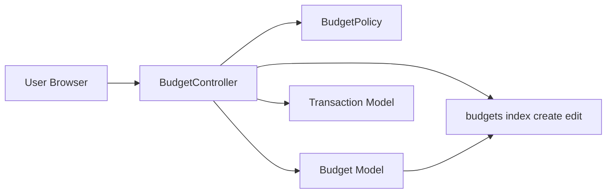

# Technical Design: 予算管理の機能を完成

---
**Purpose**: 実装者が一貫した実装を行えるよう、要件に対応するコンポーネントとインターフェースを定義する。
---

## Overview

本機能は、既存の予算CRUD・年月絞り込みに加え、**予算に対する進捗（実績）の表示**と**同一年月・カテゴリの重複防止**を追加し、product.md で定義する「カテゴリ別予算の設定と進捗確認」を完成させる。

**対象ユーザー**: ログイン済みユーザー。予算一覧で指定年月のカテゴリ別予算と実績・残り・超過の有無を確認し、予算の登録・編集・削除を行う。

**影響**: 予算一覧画面に実績・残り・達成率/超過の列を追加する。store/update 時に同一 user_id・year・month・category_id の重複をバリデーションで拒否し、友好的なエラーメッセージを返す。既存の Policy・ルート・Model は維持する。

### Goals

- 予算一覧で各カテゴリの予算額・実績額・残り（および達成率/超過の判別）を表示する（要件3）。
- 予算の登録・編集時に同一年月・カテゴリの重複をアプリ層で検証し、エラーメッセージを返す（要件5）。
- 既存の認可・データ分離（Policy、user_id スコープ）を維持する（要件1, 2, 4）。

### Non-Goals

- 予算のコピー・一括設定・複数月一括編集は対象外。
- ダッシュボード等への実績表示の再利用は将来検討。本設計では予算一覧のみ。

---

## Architecture

### Existing Architecture Analysis

- **現状**: Laravel MVC。BudgetController が Budget を user_id・year・month で取得し、`budgets.index` に渡している。編集・削除は BudgetPolicy で認可。Transaction は `forMonth`・`expense` スコープを持つ。
- **維持する境界**: Controller ↔ Model ↔ Policy。認証済みルートグループ内の `Route::resource('budgets', ...)`。
- **変更点**: index で Transaction を集計し実績を付与。store/update で重複バリデーションを追加。

### Architecture Pattern & Boundary Map

- **パターン**: 既存のリソースコントローラー + Policy + Eloquent。新規サービスは設けず、Controller 内で Transaction を集計する（research.md 参照）。
- **境界**: 予算ドメインは Budget + BudgetPolicy。実績は Transaction の読み取りのみ。重複チェックはバリデーション層。
- **Steering 準拠**: Policy による認可、user_id スコープ、Blade による一覧/作成/編集。

### Technology Stack

| Layer | Choice / Version | Role in Feature | Notes |
|-------|------------------|-----------------|-------|
| Frontend | Blade, Tailwind | 予算一覧に実績・残り・超過表示を追加 | 既存 components 利用 |
| Backend | Laravel 12, PHP 8.2+ | BudgetController の index で実績集計、store/update で unique バリデーション | 既存 |
| Data | MySQL, Eloquent | budgets 既存スキーマ、Transaction の集計読み取り | unique 制約既存 |

---

## Requirements Traceability

| Requirement | Summary | Components | Interfaces |
|-------------|---------|------------|------------|
| 1.1 | 新規登録後その年月の一覧へリダイレクト | BudgetController, View | store → redirect |
| 1.2 | 編集後その年月の一覧へリダイレクト | BudgetController, View | update → redirect |
| 1.3 | 削除後一覧へリダイレクト | BudgetController, View | destroy → redirect |
| 1.4 | 不正入力時エラーメッセージ表示 | BudgetController, View | validate, $errors |
| 1.5 | 所有者のみ登録・編集・削除可 | BudgetPolicy, BudgetController | authorize |
| 2.1 | 一覧はデフォルト当月、当該ユーザーのみ | BudgetController | index |
| 2.2 | 年・月フィルタで指定年月の一覧 | BudgetController, View | GET year, month |
| 2.3 | 一覧にカテゴリ名・予算額・編集・削除 | View | index テーブル |
| 2.4 | 一覧は当該ユーザーの予算のみ | BudgetController | where user_id |
| 3.1 | 各予算行に実績（支出合計）を表示 | BudgetController, Transaction, View | index で集計・表示 |
| 3.2 | 予算額・実績・残り・達成率/超過を判別可能に表示 | View | index 列追加 |
| 3.3 | 取引が無い場合は実績 0 | BudgetController / View | 集計結果の欠損を 0 扱い |
| 3.4 | 実績は当該ユーザー・指定年月・支出のみ | BudgetController, Transaction | forMonth, expense |
| 4.1 | 他ユーザー予算の編集・削除は 403 | BudgetPolicy | update, delete |
| 4.2 | 一覧は user_id 一致のみ | BudgetController | where user_id |
| 4.3 | 作成時に user_id を紐づける | BudgetController | store で Auth::id() |
| 5.1 | 新規登録時の重複を拒否しメッセージ表示 | BudgetController | unique バリデーション |
| 5.2 | 編集時の重複を拒否しメッセージ表示 | BudgetController | unique バリデーション（除外付き） |

---

## Components and Interfaces

| Component | Domain/Layer | Intent | Req Coverage | Key Dependencies | Contracts |
|-----------|--------------|--------|--------------|------------------|-----------|
| BudgetController | HTTP | 予算CRUD・一覧・実績付与・重複バリデーション | 1.x, 2.x, 3.x, 4.x, 5.x | Budget, Transaction, BudgetPolicy, Auth | API（Web） |
| budgets/index View | View | 一覧（予算・実績・残り・超過表示）、年月フィルタ、編集・削除 | 2.x, 3.x | Controller から渡す変数 | State |
| BudgetPolicy | AuthZ | 閲覧・作成・更新・削除の認可 | 1.5, 4.1 | User, Budget | Policy |
| Budget Model | Domain | 予算エンティティ、user/category リレーション | 1.x, 2.x, 5.x | User, Category | Eloquent |
| Transaction Model | Domain | 実績集計用の読み取り（forMonth, expense） | 3.x | User, Category | Eloquent |

### HTTP 層

#### BudgetController

| Field | Detail |
|-------|--------|
| Intent | 予算の一覧・作成・編集・削除を扱い、一覧では実績を付与して表示する。重複登録・更新をバリデーションで拒否する。 |
| Requirements | 1.1–1.5, 2.1–2.4, 3.1–3.4, 4.1–4.3, 5.1, 5.2 |

**Responsibilities & Constraints**

- index: 年月はリクエストまたはデフォルト当月。Budget を user_id・year・month で取得。Transaction を user_id・forMonth・expense で category_id 別に合計し、各 budget に実績・残り・超過フラグを付与して View に渡す。
- store: year, month, category_id, amount をバリデーション。unique（user_id, year, month, category_id）を user スコープで適用。保存後その年月の一覧へリダイレクト。
- update: 同様のバリデーション。unique は当該 budget の id を除外。authorize('update', $budget) 済み前提。
- destroy: authorize('delete', $budget) 後削除し一覧へリダイレクト。
- 実績の算出対象: 当該ユーザー、指定年月、type=expense の取引のみ。category_id で groupBy した合計。

**Dependencies**

- Inbound: Request, Auth — 認証・パラメータ（P0）
- Outbound: Budget, Transaction — 取得・集計・永続化（P0）
- Outbound: BudgetPolicy — 認可（P0）

**Contracts**: API [x]（Web ルート）

##### API Contract（予算関連）

| Method | Endpoint | Request | Response | Errors |
|--------|----------|---------|----------|--------|
| GET | /budgets | year, month (optional) | index ビュー（budgets, year, month, 実績付き） | 302 login |
| POST | /budgets | year, month, category_id, amount | 302 一覧 | 422 バリデーション、重複時メッセージ |
| GET | /budgets/create | year, month (optional) | create ビュー | - |
| GET | /budgets/{id}/edit | - | edit ビュー | 403, 404 |
| PUT/PATCH | /budgets/{id} | year, month, category_id, amount | 302 一覧 | 403, 422 重複 |
| DELETE | /budgets/{id} | - | 302 一覧 | 403, 404 |

**Implementation Notes**

- 実績集計は 1 クエリに留める（Transaction::where(...)->forMonth(...)->expense()->selectRaw('category_id, sum(amount) as total')->groupBy('category_id')->pluck('total','category_id')）。取得した連想配列を各 budget の category_id で参照し、実績・残り・超過を付与。
- 重複時: バリデーションで `Unique` ルール（user スコープ、update 時は当該 id 除外）を使用。DB 制約違反時は catch して同じメッセージで 422 を返すフォールバックを検討（research.md）。

### View 層

#### budgets/index

| Field | Detail |
|-------|--------|
| Intent | 指定年月の予算一覧を、カテゴリ名・予算額・実績・残り・達成率/超過・操作（編集・削除）で表示する。 |
| Requirements | 2.3, 3.1, 3.2, 3.3 |

**Implementation Notes**

- Controller から `budgets`（各要素に実績・残り・超過フラグまたは達成率を付与したコレクション）、`year`、`month` を受け取る。
- テーブル列: 分類（カテゴリ名）、予算額、実績額、残り、達成率または超過表示、操作。残りが負の場合は「超過」等の表示で判別可能にする。

### ドメイン層

#### Budget Model

- 既存のまま。fillable: user_id, year, month, category_id, amount。リレーション: user, category。変更なし。

#### BudgetPolicy

- 既存のまま。viewAny/create は true、view/update/delete は `$user->id === $budget->user_id`。変更なし。

---

## Data Models

### Domain Model

- **Aggregate**: Budget（user に属し、year, month, category_id で一意）。
- **Invariants**: 同一 user_id・year・month・category_id の予算は 1 件まで（DB unique + アプリバリデーション）。
- **実績**: 集計のみ。Transaction の読み取りで、Budget エンティティには持たない。

### Logical / Physical

- **budgets**: id, user_id, year, month, category_id, amount, timestamps。unique(user_id, year, month, category_id)、index(user_id, year, month)。変更なし。
- **transactions**: 実績算出は既存スキーマの読み取りのみ。where user_id, whereYear/month(date), type=expense、groupBy category_id、sum(amount)。

---

## Error Handling

### Error Strategy

- **4xx**: バリデーションエラーは 422 でフィールド単位のメッセージ。他ユーザー予算の編集・削除は Policy で 403。存在しない予算は 404。
- **重複（要件5）**: バリデーションで「この年月・このカテゴリの予算は既に登録されています」等のメッセージを返す。DB の unique 違反時は catch し同様のメッセージで 422 を返すフォールバックを推奨。

### Error Categories and Responses

| 種別 | 条件 | 応答 |
|------|------|------|
| User | 不正入力（年・月・カテゴリ・金額） | 422、バリデーションメッセージ |
| User | 重複（同一 user・年・月・カテゴリ） | 422、友好メッセージ |
| AuthZ | 他ユーザーの予算の編集・削除 | 403 Forbidden |
| Not Found | 存在しない budget id | 404 |

---

## Testing Strategy

- **Unit**: 重複バリデーションルールのテスト（同一 user・年・月・カテゴリで失敗することを検証）。任意で Budget のスコープ。
- **Feature**: 予算一覧で実績・残り・超過が表示されること。年月フィルタで絞り込めること。予算の作成・編集・削除がリダイレクトとメッセージで成功すること。重複登録・重複更新で 422 とメッセージが返ること。他ユーザー予算の編集・削除で 403 となること。
- **E2E/UI**: 認証済みユーザーが一覧・作成・編集・削除・フィルタを操作し、実績列が期待通りであることを確認（任意）。

---

## Supporting References

- 調査・判断の詳細: `.kiro/specs/budget-management/research.md`
- 既存: `app/Http/Controllers/BudgetController.php`, `app/Policies/BudgetPolicy.php`, `app/Models/Budget.php`, `app/Models/Transaction.php`, `resources/views/budgets/index.blade.php`
